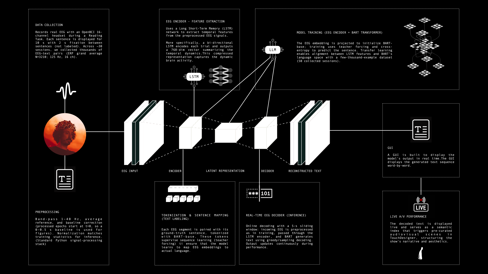
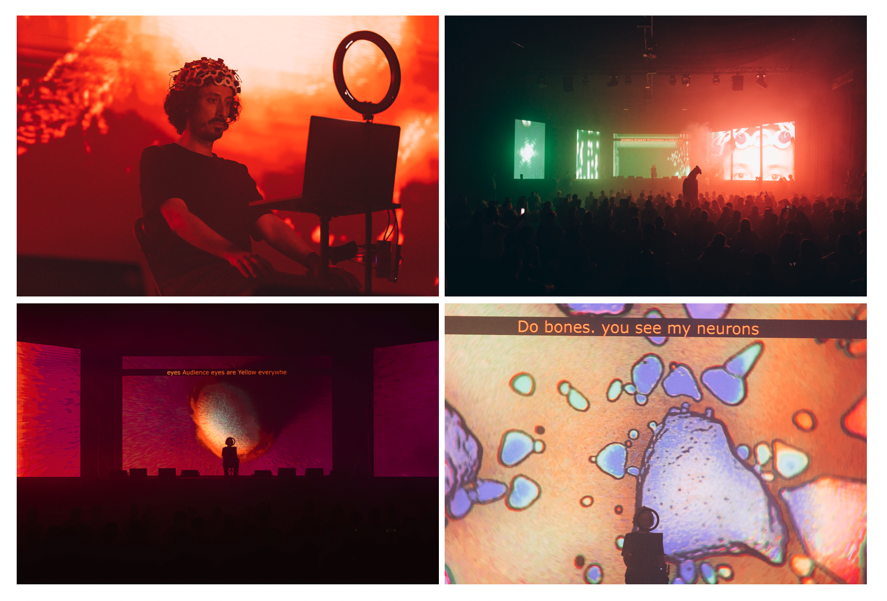
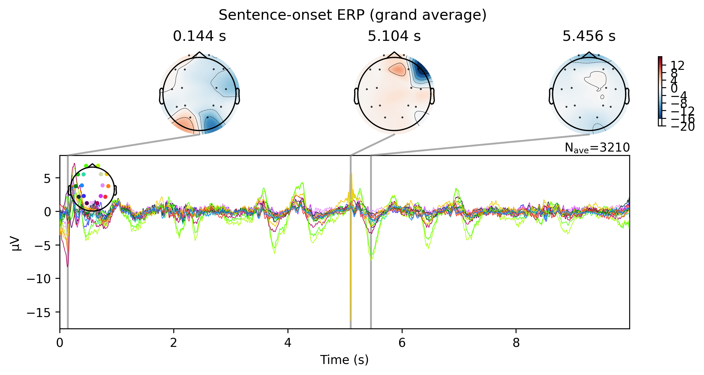
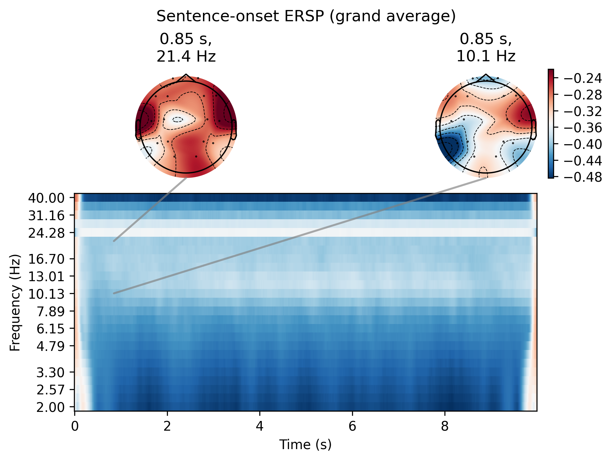
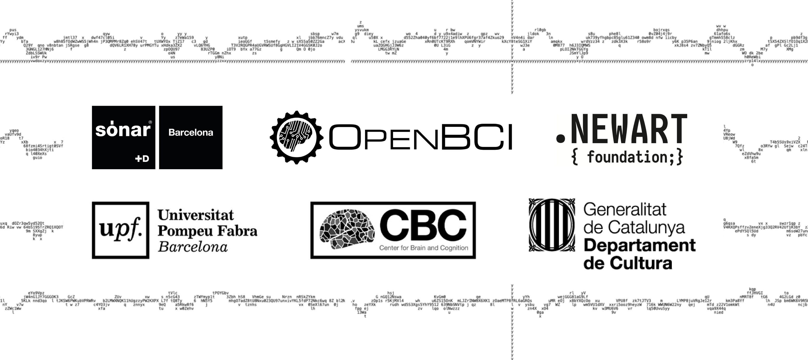

# SYNAPTICON: Closed-Loop AI Multimodal Generation from Brain Signals: A BCI Framework Integrating EEG Decoding with LLMs and Transformers.

# 

> **ABSTRACT**
> 
> SYNAPTICON} is a research prototype at the intersection of neuro-hacking, non-invasive brain-computer interfaces (BCIs), and foundational models, probing new territories of human expression, aesthetics, and AI alignment. Envisioning a cognitive “Panopticon” where biological and synthetic intelligent systems converge, it enables a pipeline that couples temporal neural dynamics with pretrained language representations and operationalizes them in a closed loop for performance. At its core lies a live “Brain Waves-to-Natural Language-to-Aesthetics” system that translates neural states into decoded speech, and then into immersive audiovisual output, shaping altered perceptual experiences and inviting audiences to directly engage with the user’s mind. SYNAPTICON provides a reproducible reference for foundation-model-assisted BCIs, suitable for studies of speech decoding, neuroaesthetics, and human–AI co-creation.
>
> **NeurIPS 2025 PAPER:**
> + Barque-Duran, A., Llauradó, A; (2025) **How Foundation Models Are Reshaping Non-Invasive Brain–Computer Interfaces: A Case for Novel Human Expression and Alignment.** 39th Annual Conference on Neural Information Processing Systems - NeurIPS 2025.
>
> **AUDIOVISUAL DOCUMENTATION:**
> + Info: https://albert-data.com/pages/synapticon
> # 

---

## 1) Overview (this open-source repository contains a computationally lighter encoder for experimentation or deployment (vs. the model presented in the original author's paper))

**What the original-system does:**  
Using a 16-channel OpenBCI headset, signals are filtered and baseline-aligned, then compressed by a bi-LSTM and injected into BART-base, which autocompletes text directly from neural dynamics. A 5 s streaming window keeps the decoder live, so thoughts during reading (or imagined speech) become words that orchestrate audiovisual scenes on stage. Instead of bespoke decoders, SYNAPTICON aligns EEG with a foundation model’s language space, dramatically boosting expressivity and enabling continuous, open-vocabulary interaction. The system functions as both research apparatus and performance instrument, demonstrating how neuro-LLMs can externalize inner cognition and reshape human–AI co-creativity.
# 
# 
**What this lite-system does:**  
The system combines real-time EEG acquisition, signal preprocessing, and deep learning models to investigate how neural activity can be mapped onto natural language representations. The workflow consists of four main stages:

- **Stimulus presentation & EEG recording**: Participants are shown sentences full-screen in a timed sequence while EEG data is collected in parallel. Each trial produces a labeled 10-second neural recording window aligned with the presented text.
- **Data preprocessing**: Raw EEG streams are filtered (notch + band-pass), padded or truncated to a consistent length, and packaged into compressed .npz tensors. This ensures clean, uniform input for model training.
- **EEG→Text modeling**: A custom neural architecture encodes the multichannel EEG window with a stack of 1D CNN layers, projects it into a latent sequence with positional embeddings, and conditions a Transformer decoder-only language model to predict the corresponding text tokens.
- **Live inference loop**: A trained checkpoint can be deployed in real time. As new EEG signals are recorded, the system preprocesses them on the fly and attempts to decode the participant’s “neural response” back into text, while synchronizing with the visual stimulus display.

This codebase therefore demonstrates the full pipeline: from human-subject data acquisition, to signal cleaning and representation, to training a generative decoder, and finally deploying a closed-loop system for online inference. While experimental and exploratory, it provides a foundation for research into cognitive–AI co-adaptation, interpretability of neural signals, and the ethics of neurotechnology.

---

## 2) Repository layout

```
synapticon/
├─ README.md
├─ LICENSE
├─ requirements.txt
├─ data/
│  ├─ synapticon_sentences.csv     # provided by the author
│  └─ raw/                         # your recorded EEG sessions (CSV)
│     ├─ session_00.csv
│     └─ session_01.csv
├─ data_npz/                       # converted, model‑ready files (.npz)
├─ models/                         # trained checkpoints
├─ outputs/                        # logs from live inference
├─ eeg_cnn_decoder.py
└─ scripts/
   ├─ collect_eeg_data.py
   ├─ convert_to_npz.py
   ├─ train_model.py
   └─ inference_live.py
```

---

## 3) Requirements & Setup

- **Python 3.10+** recommended  
- Install deps:  
  ```bash
  pip install -r requirements.txt
  ```
- **Hardware**: OpenBCI Cyton + Daisy (16‑ch) or another BrainFlow‑supported board.  
- **macOS (Apple Silicon)**: PyTorch will use **MPS** automatically if available; otherwise CPU.

> You’ll need the board drivers/firmware configured per BrainFlow’s docs. On macOS, grant the serial port permission to the OpenBCI dongle (e.g., `/dev/cu.usbserial-XXXX`).

---

## 4) Usage — end‑to‑end

### 4.1 Collect EEG while presenting sentences
1) Put your CSV of sentences here:
```
data/synapticon_sentences.csv
```
2) Open `scripts/collect_eeg_data.py` and set:
   - `serial_port = "<your-serial-port>"`
   - `session_index = <00, 01, ...>`
3) Run:
```bash
python scripts/collect_eeg_data.py
```
This creates `session_<index>.csv` (we recommend saving into `data/raw/`; see “Path conventions” below).

### 4.2 Convert sessions → NPZ
```bash
python scripts/convert_to_npz.py --csv_dir data/raw --out_dir data_npz
```
This applies notch + band‑pass filtering and pads/truncates each window to a fixed length.


### 4.3 Train the EEG→Text model
```bash
python scripts/train_model.py   --npz_dir data_npz   --sentences_csv data/synapticon_sentences.csv   --epochs 15 --batch 8
```
Checkpoints are saved to `models/` (best model is written automatically).


### 4.4 Live inference
```bash
python scripts/inference_live.py   --model models/best_eeg2text_epochXX.pt   --sentences_csv data/synapticon_sentences.csv   --serial_port <your-serial-port>   --output outputs/live_inference.txt
```

> Press **E** during collection/inference to safely abort.

---

## 5) Troubleshooting

- **Board not found / serial errors** → set the correct `serial_port` (macOS: `/dev/cu.usbserial-XXXX`). Confirm dongle permissions.  
- **Tokenizer warnings** → you can set `TOKENIZERS_PARALLELISM=false` in your shell to silence parallelism messages.  
- **Long install on macOS** → first install a recent `pip` and `setuptools`, then install PyTorch with MPS support.

---

## 6) License & responsible use

- **License**: The *code* in this repository is released under the **MIT License** (see `LICENSE`).  
- **No open weights / no open data**: To protect privacy and align with the project’s neuro‑rights goals, **model weights and EEG datasets are not distributed**.  
- **Ethical use**: Any data collection must comply with local regulations and institutional ethics/IRB guidelines. Obtain informed consent, allow withdrawal at any time, and avoid any use that could harm participants. Live experiments should implement safe abort and clear on‑screen instructions.  
- **Contact**: For research collaborations or requests to access derived artifacts under an ethics agreement, please reach out directly.

---

## 7) Credits
- **Directed, Produced & Developed**: Albert Barqué-Duran (Albert.DATA).
- **Technical Managers**: Ada Llauradó & Ton Cortiella.
- **Audio Engineer**: Jesús Vaquerizo (I AM JAS).
- **Extra Performer**: Teo Rufini.
- **Partners**: Sónar+D; OpenBCI; BSC (Barcelona Supercomputing Center); .NewArt { foundation;}; CBC (Center for Brain & Cognition); Universitat Pompeu Fabra; Departament de Cultura - Generalitat de Catalunya.
# 


